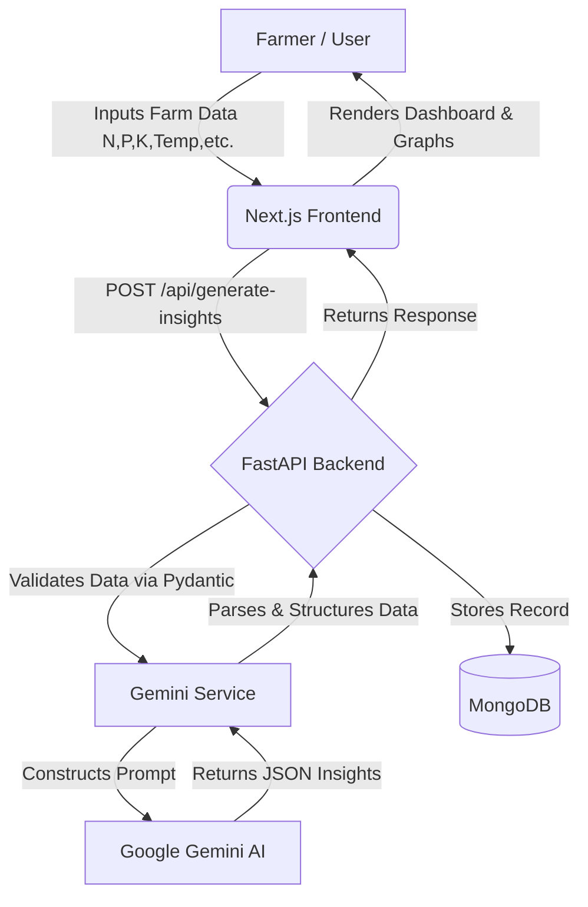
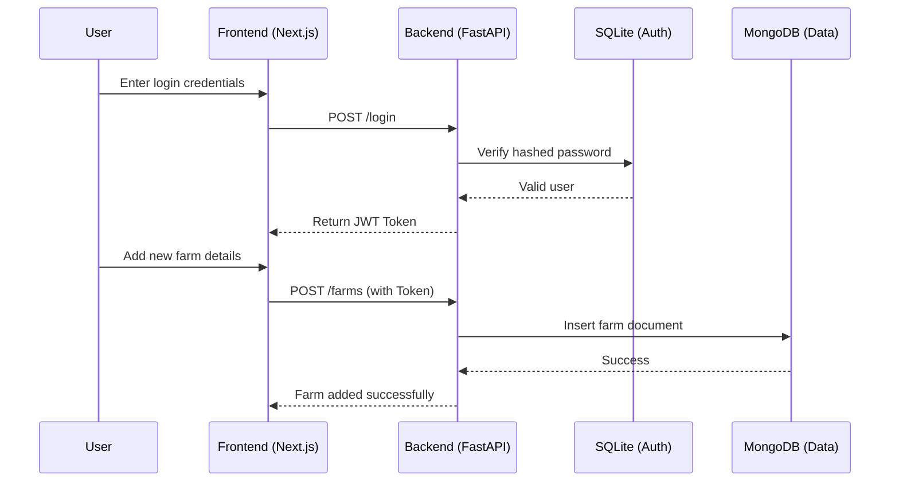

# AI Agriculture Portal: Comprehensive Project Report

## 1. Introduction

The global agricultural landscape is currently standing at a critical juncture. With the world's population projected to reach nearly 10 billion by 2050, the demand for food is escalating at an unprecedented rate. Simultaneously, the agricultural sector faces severe infrastructural and environmental challenges, including unpredictable climate change variables, rampant soil degradation, water scarcity, and a reduction in arable land. Traditional farming methods, which often rely on intuition and generalized, region-wide practices rather than hyper-local data, are becoming increasingly inefficient and insufficient to meet these growing demands.

To address these compounding issues, **Precision Agriculture** has emerged as a revolutionary paradigm. Driven by advancements in Data Science, the Internet of Things (IoT), and Artificial Intelligence (AI), precision farming shifts the focus from broad-stroke agriculture to micro-level resource optimization. 

The **AI Agriculture Portal** is a comprehensive, sophisticated web application purpose-built to empower modern farmers, agronomists, and agricultural stakeholders. By digitalizing farm properties and centralizing crucial environmental and soil metrics, the portal acts as a highly intelligent, localized agronomy assistant. It acts as the critical bridge between raw sensor-style data and actionable human-readable intelligence, transforming abstract numbers (like soil pH or nitrogen levels) into concrete, localized agricultural strategies that maximize crop yields while simultaneously minimizing resource waste and environmental impact.

---

## 2. Theoretical Background

### 2.1 Problem Statement
**Design a Data Science system for smart agriculture using IoT and AI to improve crop yield.**

### 2.2 Core Agronomic Metrics
The foundation of the portal relies on capturing and analyzing seven critical parameters that fundamentally dictate plant health and yield potential:
1. **Macronutrients (N-P-K):** 
   - **Nitrogen (N):** Crucial for vegetative growth and photosynthesis.
   - **Phosphorus (P):** Vital for root development and energy transfer.
   - **Potassium (K):** Regulates water intake and disease resistance.
2. **Soil pH:** Determines the bioavailability of the aforementioned nutrients. Extreme pH levels can lock nutrients in the soil, rendering them inaccessible to crop roots.
3. **Climatic Factors (Temperature, Humidity, Rainfall):** Drive the evapotranspiration rates and dictate the specific crop varieties that can thrive in a given microclimate.

### 2.3 The AI Paradigm Shift
Traditionally, crop yield prediction relied on rigid statistical models or basic decision trees that struggled to account for the immense, non-linear variability in multi-metric agricultural environments. 
By integrating Large Language Models (LLMs) fine-tuned with extensive agronomic knowledge bases, the AI Agriculture Portal transcends basic numerical prediction. The AI not only cross-references the seven input parameters against optimal growth conditions but also engages in complex reasoning—identifying compound risks (e.g., how high temperatures combined with low rainfall specifically affect phosphorus uptake) and dynamically generating mitigation strategies.

### 2.4 Our Solution Overview
To execute this theoretical framework, we developed a full-stack software ecosystem. It provides farmers with a clean interface to input their parameters and immediately receive an AI-generated dossier comprising yield predictions, specific identified risks, tailored actionable recommendations, and visualization data.

---

## 3. Methodology and Architecture

The methodology for building the AI Agriculture Portal involves a decoupled architecture, clearly separating the user interface, backend processing, database management, and AI integration.

### 3.1 Architecture Overview

The system is engineered using state-of-the-art web technologies to ensure scalability, responsiveness, and security:
- **Frontend Layer (Client):** Developed using **Next.js (React, TypeScript)**. It provides a highly interactive, responsive dashboard styled with glassmorphism UI principles. The frontend handles route protection, state management, and the rendering of dynamic insight reports and visualization charts (using libraries like Recharts).
- **Backend API Layer (Server):** Powered by **FastAPI (Python)**. Chosen for its extreme performance and asynchronous capabilities, the backend manages API routing, authentication verification, and strict data validation using Pydantic models.
- **Database Layer (Dual Strategy):** 
  - **SQLite:** Utilized structurally with SQLAlchemy for robust, relational storage of User credentials, hashed passwords, and authentication tokens, ensuring data integrity for sensitive access processes.
  - **MongoDB:** A NoSQL approach implemented via PyMongo for high-flexibility, document-based storage. It efficiently houses variable-structure crop data, farm profiles, and the deeply nested JSON objects returned by the AI insights.
- **AI Engine Layer:** Integrated with **Google Generative AI (Gemini)**. The system dynamically constructs comprehensive prompts using the user's data and forces the LLM to output tightly structured, deterministic JSON for immediate parsing.

### 3.2 Step-by-Step Execution Flow

The system carries out the insight generation process through a highly orchestrated, step-by-step pipeline:

1. **Data Acquisition:** The farmer navigates to the 'AI Insights' dashboard and submits their specific farm parameters (Crop type, N, P, K, Temp, Humidity, Rainfall, pH) via a validated frontend form.
2. **API Transmission:** The Next.js client packages this data and securely sends a POST request to the FastAPI backend endpoint `/api/ai/insights`.
3. **Backend Validation:** FastAPI intercepts the payload and passes it through Pydantic schema validation to ensure all numerical constraints (e.g., pH between 0 and 14) and data types are strictly adhered to.
4. **Contextual Prompt Engineering:** The verified data is passed to the `gemini_service.py` module. Here, a massive, highly specific text prompt is dynamically constructed. This prompt explicitly defines the AI's persona as an expert agronomist, injects the real-time farm data, and demands a specific JSON schema output covering yield prediction, risk analysis, and recommendations.
5. **AI Inference:** The constructed prompt is transmitted securely to the Google Gemini API. The LLM processes the agronomic parameters, calculates risks, and formulates tailored advice.
6. **Data Parsing and Structuring:** Gemini returns a raw string containing the JSON. The backend strips away any markdown formatting, loads the string into a Python dictionary, and validates the presence of required keys.
7. **Persistence:** The structured insight report is saved as a new document within the MongoDB `insights` collection, tagged with the User ID for historical tracking.
8. **Client Rendering:** Finally, the FastAPI server returns the structured JSON to the Next.js frontend, which dynamically unmounts the loading states and renders the highly detailed report, complete with color-coded risk badges and visualized nutrient charts.

#### Data Flow Diagram
The following diagram illustrates how user input travels through the system to generate insights:



#### User Authentication and Farm Setup Flow



### 3.3 Core Code Implementation Examples

**AI Prompt Construction & Integration (`gemini_service.py`)**

The heart of the intelligent insights is the prompt builder that forces the LLM to act as an agronomy system and return strict JSON:

```python
def _build_prompt(crop_type, nitrogen, phosphorus, potassium, temperature, humidity, rainfall, ph_level):
    return f"""
You are an advanced agricultural intelligence system trained in agronomy, crop science, and predictive analytics.
Your task is to analyze structured farm data and return ONLY valid JSON. Do not include any markdown formatting.

INPUT DATA:
Crop: {crop_type}
Temperature: {temperature} °C
Humidity: {humidity} %
Rainfall: {rainfall} mm
Soil:
  Nitrogen: {nitrogen}
  Phosphorus: {phosphorus}
  Potassium: {potassium}
pH: {ph_level}

TASKS:
1. Predict realistic yield (kg) based on these conditions.
2. Analyze risk level (low/medium/high) with detailed agronomic reasons.
3. Generate 3-5 actionable, localized recommendations.
4. Define optimal environmental conditions for this specific crop.
5. Generate theoretical data points for frontend visualizations (comparing current vs optimal metrics).
"""
```

**MongoDB Connection Setup (`mongo.py`)**

Using `pymongo`, we connect to collections dynamically for unstructured insights:

```python
from pymongo import MongoClient
from app.core.config import settings

mongo_client = MongoClient(settings.MONGO_URL)
mongo_db = mongo_client["agri_portal"]

# Flexible NoSQL Collections
crop_collection = mongo_db["crop_data"]
farms_collection = mongo_db["farms"]
insights_collection = mongo_db["insights"]
```
### 3.4 Platform Interface Highlights

<!-- SCREENSHOT: Insert picture of the Login/Registration Page here -->

<!-- SCREENSHOT: Insert picture of the Main Dashboard showing Farm Overviews here -->

<!-- SCREENSHOT: Insert picture of the Crop Insights Report with Graphs here -->

---

## 4. Current Trends in AgriTech

The AI Agriculture Portal elegantly aligns with several major technological trends currently disrupting the global agricultural industry:
- **Hyper-Precision Agronomy:** Shifting away from generalized county-wide farming advice to specific, square-meter-level data analysis, treating individual farm sub-zones as unique micro-ecosystems.
- **LLMs in Agriculture:** Utilizing advanced natural language models to parse highly complex agronomic rules and chemical relationships into easily digestible, step-by-step advice for farmers with no technical background.
- **Cloud-Based Farm Management Systems:** Centralizing farm operational data in cloud infrastructures (via FastAPI and MongoDB) so it can be monitored and managed from any device globally.
- **Climate-Adaptive Agriculture:** Using real-time data to help farmers pivot strategies rapidly in the face of erratic changing weather patterns.

---

## 5. Future Scope and Extensibility

While the current iteration of the platform is powerful, it has been architected specifically to allow for massive future scalability and hardware integration. The future roadmap includes:

1. **Direct IoT Hardware Integration:** 
   The most imminent expansion involves replacing manual web-form data entry with live, automated data feeds. By deploying IoT sensor nodes (utilizing ESP32/Arduino microcontrollers and LoRaWAN long-range communication) directly into the soil, the platform will continuously receive live NPK, moisture, and temperature data, allowing the AI to generate real-time, dynamic alerts.
2. **Automated Actuation and Smart Irrigation:**
   Connecting the AI's output directly to farm machinery. For example, if the AI detects an impending water deficit based on low humidity and high temperatures, the backend can issue secure commands to automatically open smart-irrigation valves, creating a closed-loop system.
3. **Drone Imagery & Computer Vision (CNNs):** 
   Integrating Convolutional Neural Networks (CNNs) to analyze satellite or drone-captured multispectral imagery. This will allow the portal to visually detect crop health anomalies, localized pest infestations, or varying moisture levels that soil sensors might miss.
4. **Market & Supply Chain Predictive Analytics:** 
   Linking the AI's crop yield predictions to global real-time market pricing APIs. This evolution will advise farmers not just on *how* to grow their crops efficiently, but strategically *when* to harvest and sell to maximize financial profit.

---

## 6. Conclusion

The AI Agriculture Portal successfully demonstrates a scalable, modern software engineering solution to tackle some of the most pressing challenges in global agricultural yield optimization. By leveraging a decoupled Next.js and FastAPI architecture, alongside the dual database approach of SQLite and MongoDB, the system ensures both rigidity in security and flexibility in data processing. 

Most importantly, by bridging the gap between raw soil/weather metrics and actionable intelligence using Google Gemini AI, the system democratizes access to expert-level agronomy. It provides farmers with crucial, data-validated foresight regarding risks, optimal conditions, and expected outcomes. As the platform transitions towards direct IoT sensor integrations and automated actuations in its future iterations, it holds the profound potential to become a fully automated, closed-loop smart farming ecosystem—one that significantly enhances global food security, maximizes farming efficiency, and minimizes environmental strain.
s